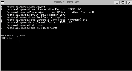
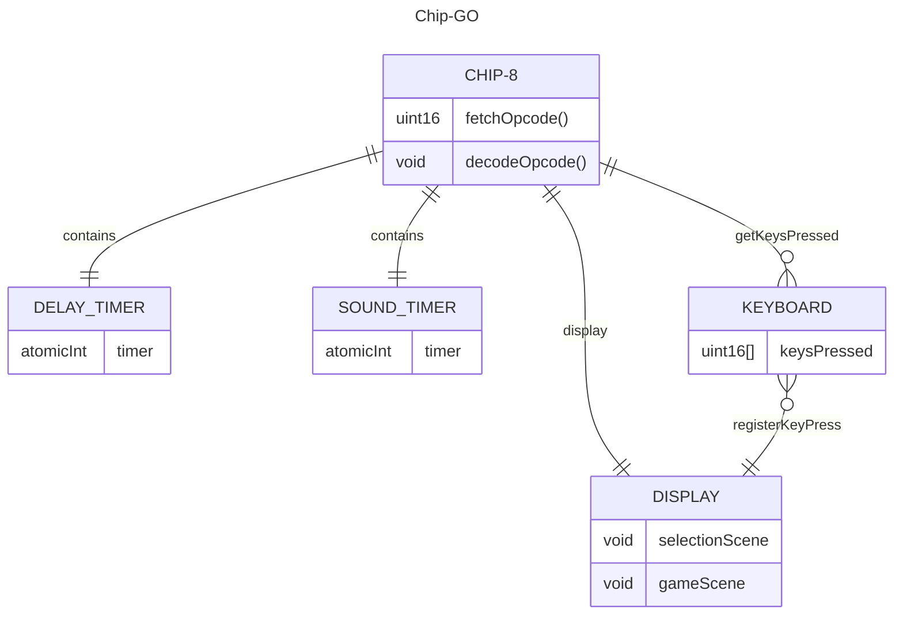

# Chip-GO
A Chip-8 emulator written in go.
Thank you to Tobias Langhoff for the [awesome guide](https://tobiasvl.github.io/blog/write-a-chip-8-emulator/)
## Features
* 📄 Paginated home selection screen
* 🕹️ Original COSMAC VIP interpreter (I didn't code any of the quirks, maybe later)
* 🔊 Beeping sounds using [faiface/beep](https://github.com/faiface/beep)
* 🖵 OpenGL rendering using [gopxl/pixel](https://github.com/gopxl/pixel)

## Demo


## Architecture
The goal for the architecture of the system was to make external dependencies as decoupled from the main interpreter logic as possible.

I leveraged Go's channels and mutexes to achieve this while benefiting from Go's concurrency model to run the different components at different speeds:
* Interpreter loop: 4Mhz
* Timers: 60Hz
* Display: 60Hz or 60fps

### Architecture overview:


## Quick start
This project uses the [gopxl/pixel](https://github.com/gopxl/pixel) lib, which uses OpenGL and GLFW. The requirements for building and executing the project depend on the underlying system. For ubuntu and WSL (I'm guessing linux in general) simply install the following packages `libgl1-mesa-dev xorg-dev libasound2-dev` [Check here for setup in different systems](https://github.com/gopxl/pixel?tab=readme-ov-file#requirements)

Once the requirements are installed:
```bash
go build
```
An executable will be generated. All that's left is to execute it!
```bash
./chip-go
```
